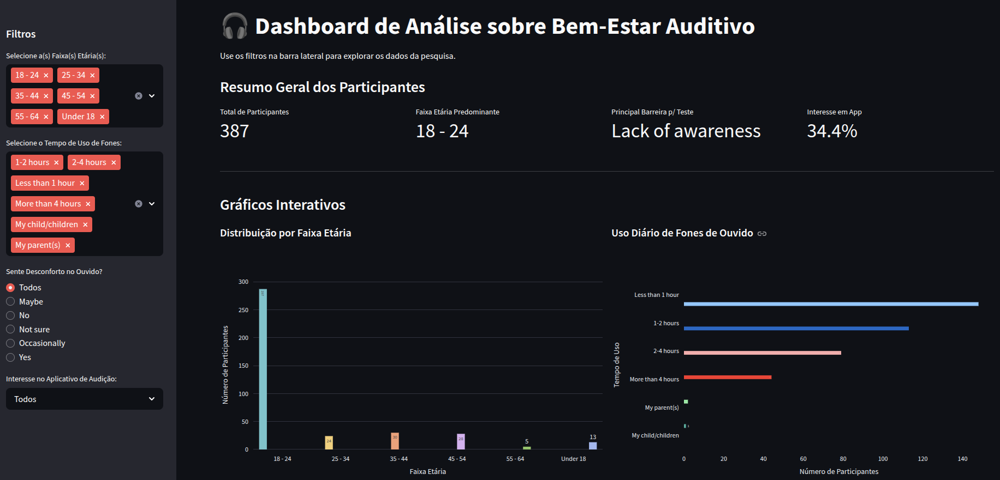

# 📊 Dashboard de Análise sobre Bem-Estar Auditivo

Este é um projeto simples e exploratório para visualizar os dados de uma pesquisa sobre bem-estar auditivo. O objetivo principal foi praticar a criação de um dashboard interativo utilizando Python, Streamlit e Plotly Express.

Este projeto não possui fins comerciais, sendo apenas um exercício de análise e visualização de dados seguindo os ensinamentos da Imersão da Alura de Dados com Python.



## 🚀 Sobre o Projeto

O dashboard carrega um conjunto de dados de uma pesquisa e permite que o usuário explore as respostas de forma visual e interativa. É possível filtrar os dados por diferentes critérios demográficos e comportamentais para descobrir insights e padrões nas respostas.

### Fonte dos Dados

O conjunto de dados utilizado neste projeto é o "2025 Hearing Wellness Survey" e está publicamente disponível no Kaggle.

- **Link para o Dataset:** [2025 Hearing Wellness Survey on Kaggle](https://www.kaggle.com/datasets/adharshinikumar/2025-hearing-wellness-survey)

### ✨ Funcionalidades

- **KPIs Dinâmicos:** Métricas principais que se atualizam de acordo com os filtros aplicados.
- **Gráficos Interativos:** Visualizações de dados criadas com Plotly Express que permitem uma exploração detalhada.
- **Filtragem de Dados:** Uma barra lateral com múltiplos filtros para segmentar a análise por:
    - Faixa Etária
    - Tempo de Uso Diário de Fones
    - Percepção de Desconforto Auditivo
    - Interesse em Aplicativos de Saúde

## 🛠️ Tecnologias Utilizadas

- **Python:** Linguagem de programação principal.
- **Streamlit:** Framework para a criação do dashboard web.
- **Pandas:** Para manipulação e análise dos dados.
- **Plotly Express:** Para a criação dos gráficos interativos.

## ⚙️ Como Executar o Projeto Localmente

Para executar este projeto em sua máquina, siga os passos abaixo.

### Pré-requisitos

- Python 3.8 ou superior
- `pip` (gerenciador de pacotes do Python)

### 1. Clone o Repositório (ou Baixe os Arquivos)

Primeiro, obtenha os arquivos do projeto. Se estiver usando git:
```bash
git clone https://github.com/mathgoms02/imersao-dados-alura.git
cd imersao-dados-alura
```
Caso contrário, apenas certifique-se de que o script Python (app.py), o requirements.txt e o arquivo de dados (Hearing well-being Survey Report.csv) estejam na mesma pasta.

### 2. Crie um Ambiente Virtual (Recomendado)

É uma boa prática usar um ambiente virtual para isolar as dependências do projeto.

```bash
# Criar o ambiente
python -m venv venv

# Ativar o ambiente
# No Windows:
venv\Scripts\activate
# No macOS/Linux:
source venv/bin/activate
```

### 3. Instale as Dependências

Use o arquivo requirements.txt para instalar todas as bibliotecas necessárias com um único comando:

```bash
pip install -r requirements.txt
```

### 4. Execute a Aplicação Streamlit

Com as dependências instaladas, inicie o servidor do Streamlit:

```bash
streamlit run seu_script.py
```

Substitua seu_script.py pelo nome que você deu ao seu arquivo Python.

O dashboard deverá abrir automaticamente em seu navegador padrão!